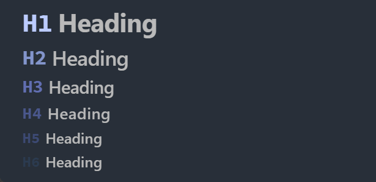

# obsidian-snippets

This repository stores some css I commonly used

# Table of Contents

- [Clutter-Free Headings](#clutter-free-headings)

---

## Clutter-Free Headings

<https://github.com/Shelton212/obsidian-snippets/blob/master/clutter-free-headings.css>

WYSIWYG-ish headings which line up headings, show the formatting markers when editing
and replace them with a muted "H1", "H2" etc when not the active line.

I modified it based on [this version](https://github.com/deathau/obsidian-snippets/blob/main/clutter-free-headings.css) because it only works on  legacy editor

---
